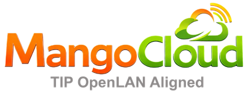

  
  &nbsp;&nbsp;&nbsp;&nbsp;&nbsp;&nbsp;&nbsp;&nbsp;&nbsp;&nbsp;&nbsp;&nbsp;
  

# OpenWiFi Provisioning Service (OWPROV)

## Overview / What is it?
The OWPROV (OpenWiFi Provisioning Service) is a core service within the Telecom Infra Project (TIP) OpenWiFi CloudSDK (OWSDK) ecosystem.

OWPROV is responsible for:
* Managing inventory and provisioned TIP OpenWiFi-compatible devices (Access Points, Switches, and Gateways).
* Organizing devices into hierarchical structures using **Entities** and **Venues**.
* Generating device-specific configurations matching the uCentral schema.

Like all other OWSDK microservices, OWPROV is defined using an OpenAPI definition and communicates asynchronously with other services via Kafka, while exposing a REST API for management interfaces. Rather than communicating directly with Access Points, it integrates with the uCentral Gateway (`owgw`), which manages the WebSocket connections to the physical hardware.

To use OWPROV, you can either [build it from source](#building) or deploy the containerized version using [Docker](#docker).

## Role in Mango Cloud

This service is part of [Mango Cloud](https://www.mangowifi.cloud/), Router Architects’ open-source platform for managed Wi-Fi and connectivity operations.

Within Mango Cloud, **OWPROV** serves as the central provisioning and organizational layer for managing:

* **Operators & Default Entities**: Orchestrates the multi-tenant onboarding of network operators and default environments.
* **Hierarchical Organization**: Defines entity and location structures to map physical networks.
* **Venues & Inventory Ownership**: Directs venue configurations and tracks device inventory assignments.
* **Subscriber Management**: Manages individual subscribers and auto-created subscriber venues.
* **Device Onboarding**: Governs the onboarding flow for gateways (**OLG**), access points, and mesh nodes.
* **Device Lifecycle Relationships**: Maintains the state and topology of connected hardware.

OWPROV exposes its functionality through an OpenAPI-compliant REST interface, integrating seamlessly with the rest of the Mango Cloud services to power residential Wi-Fi, MDU (Multi-Dwelling Unit), and managed-connectivity workflows.

### Resources
* [Mango Cloud Website](https://www.mangowifi.cloud/)
* [Mango Cloud Deployment Guide](https://github.com/routerarchitects/mango-cloud-deployment)
* [Router Architects GitHub Organization](https://github.com/routerarchitects)

### Provisioning Guides
* [Provisioning Model Overview](https://www.mangowifi.cloud/docs/operations/provisioning-hierarchy-owprov/provisioning-model-overview)
* [End-to-End Provisioning Workflow](https://www.mangowifi.cloud/docs/operations/provisioning-hierarchy-owprov/provisioning-workflow-end-to-end)

## OpenAPI
The OWPROV-REST-API is defined in the OpenAPI specification [openapi/owprov.yaml](https://raw.githubusercontent.com/routerarchitects/ra-wlan-cloud-owprov/refs/heads/main/openapi/owprov.yaml). You can use this OpenAPI definition to inspect endpoints, generate client SDKs, or build static documentation.

## Building
To build the microservice from source, please follow the instructions in [BUILDING.md](./BUILDING.md).

## Docker
To use the containerized CloudSDK deployment, please refer to the deployment guide in the [mango-cloud-deployment](https://github.com/routerarchitects/mango-cloud-deployment) repository.

## Domain and behavior documentation

### Root entity
* Its UUID value is `0000-0000-0000`.
* Its parent entity must be empty.

### Entity
#### Creation rules
* You must set the parent of an entity.
* The only properties you may set at creation (via `POST`) are:
  * `name`
  * `description`
  * `notes`
  * `parent`

#### Modification rules
You may modify the following fields using a `PUT` request:
* `name`
* `description`
* `notes`

#### Delete
* Children must be empty before deleting an entity.

### Inventory Tags
#### Creation rules
* Entity must point to an existing non-root entity.
* If you associate a venue, it must exist.
* You must use an existing device type. Device type cannot be empty.
* Name, description, and notes are allowed.
* Inventory ownership updates automatically on device assignment.

#### Modification rules
* You can modify the device type to another valid one.

### Venue
#### Creation rules
* If you include an entity, the parent must not be set.
* If you include a parent, the entity must not be set.
* You cannot have children upon creation.
* You may include an array of device UUIDs.
* Topology and design cannot be set.
* Each subscriber receives an auto-created venue; it cannot be deleted while devices remain.

### Operator
#### Creation rules
* Creating an operator automatically creates and links a default entity.

#### Delete
* Subscribers under the operator must be deleted first.
* Deleting the operator then removes the auto-created entity.

### Subscriber
#### Creation rules
* Creating a subscriber automatically creates and links a default subscriber venue.
* Email verification is supported; the link can be resent.

#### Subscriber device onboarding rules
* The first device per subscriber becomes the gateway (**OLG**); subsequent devices become AP/mesh nodes.
* Only one gateway is allowed per subscriber; it cannot be deleted until its mesh devices are removed.
* Monitoring auto-enables on gateway addition (can be toggled in the UI).

#### Delete
* Subscriber deletion is allowed only when no devices remain.
* Device deletion follows hierarchy (remove mesh nodes before the gateway).
* After devices are removed, deleting the subscriber also removes its auto-created venue.

## Configuration
OWPROV configuration parameters are kept in a file called `owprov.properties`. To understand the configuration details, please see [CONFIGURATION.md](./CONFIGURATION.md).

### Firewall Considerations
Depending on your deployment, ensure that firewalls allow traffic on the following ports:

| Port  | Service Type / Description | Configurable |
|:------|:-----------------------------------------------|:------------:|
| **16005** | Public REST API Access for management UIs (e.g., `owprov-ui`) | yes|
| **17005** | Internal REST API Access for intra-microservice communication | yes|
| **16105** | Application Load Balancer (ALB) health check endpoint | yes|

## Kafka topics
To read more about Kafka integration across microservices, follow the [wlan-cloud-ucentralgw Kafka Documentation](https://github.com/Telecominfraproject/wlan-cloud-ucentralgw/blob/main/KAFKA.md).
